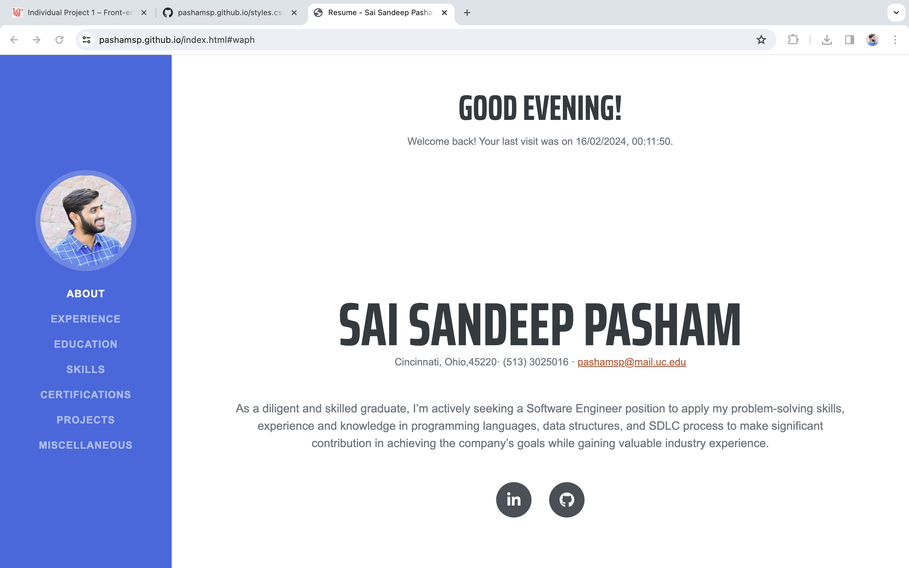
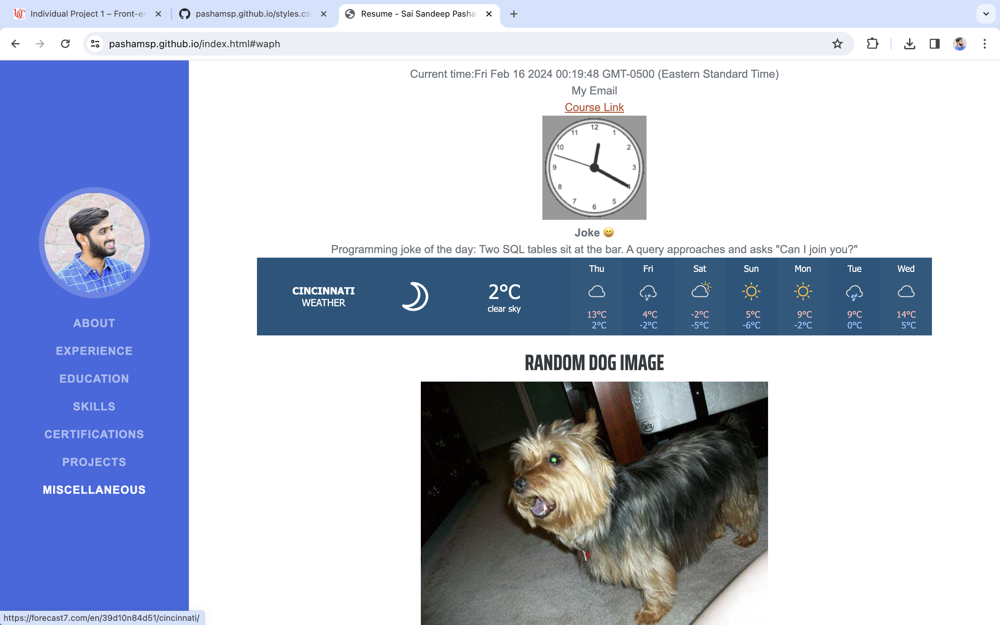
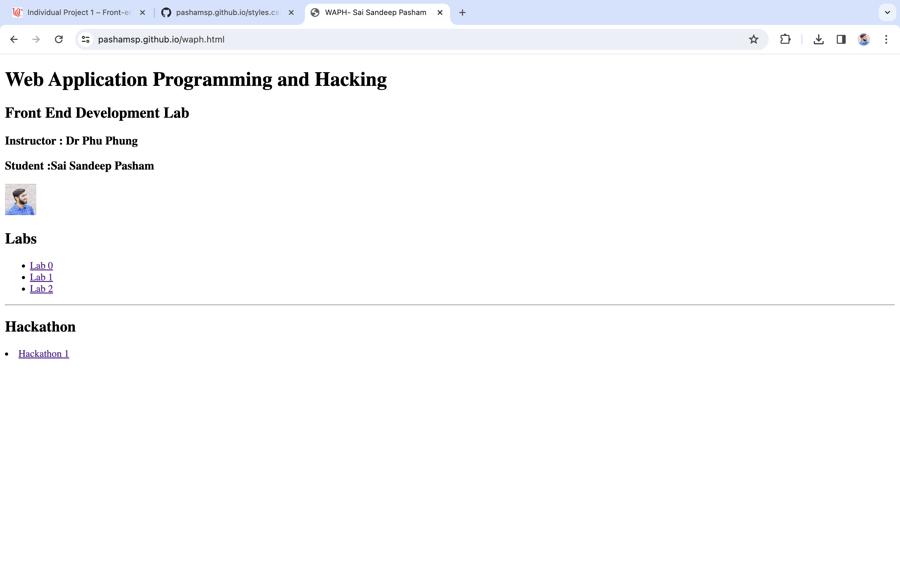
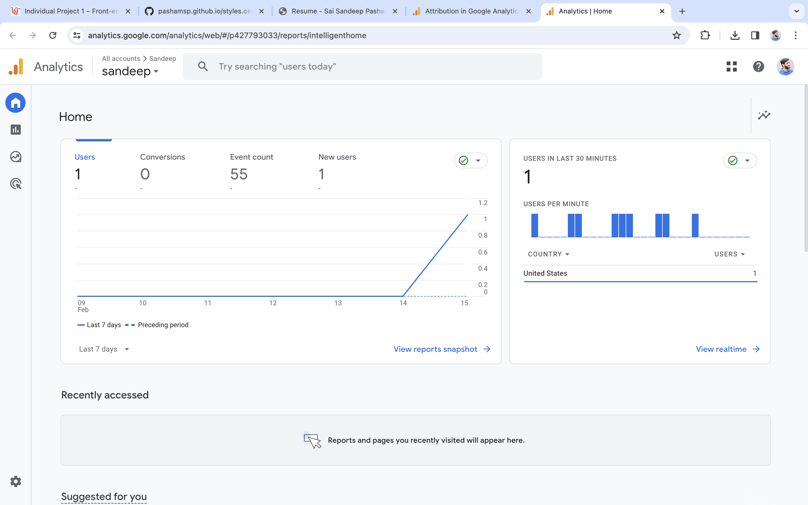
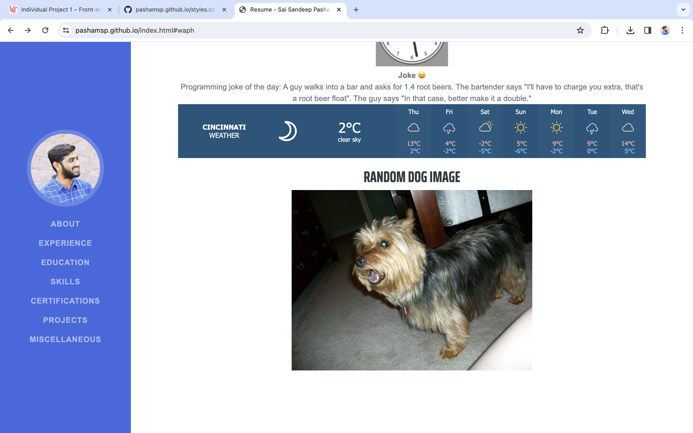

# WAPH-Web Application Programming and Hacking

## Instructor: Dr. Phu Phung

## Student

**Name**: Sai Sandeep Pasham

**Email**: pashamsp@mail.uc.edu

{width=150px height=150px}


## Individual Project 1 - Professional Profile Website

**Overview**: This project involves creating a front-end web development portfolio hosted on GitHub Pages. The implementation includes a personal portfolio developed using JavaScript, jQuery, and the React library. Additionally, two public web APIs are integrated, and JavaScript cookies are employed to remember and greet users upon revisiting the website. For the technical framework, an open-source Bootstrap framework is utilized, and Google Analytics page tracker is incorporated.
Link to the repository:
[https://github.com/pashamsp/pashamsp.github.io/blob/main/README.md](https://github.com/pashamsp/pashamsp.github.io/blob/main/README.md)

\pagebreak

I have customized a Bootstrap template obtained from [https://startbootstrap.com/theme/resume](https://startbootstrap.com/theme/resume) to create my personal portfolio. The portfolio features a professional profile showcasing my resume, complete with a headshot, contact details, educational background, work experiences, and skills. Additionally, I've incorporated a link to a new HTML page highlighting completed Hackathons and Labs from the WAPH coursework.







\pagebreak

This portfolio incorporates a Google Analytics page tracker to observe and analyze traffic and statistics..

```JS
<!-- Google tag (gtag.js) -->
<script async src="https://www.googletagmanager.com/gtag/js?id=G-MWDM1VYXKH"></script>
<script>
  window.dataLayer = window.dataLayer || [];
  function gtag(){dataLayer.push(arguments);}
  gtag('js', new Date());

  gtag('config', 'G-MWDM1VYXKH');
</script>
```


\pagebreak

This portfolio utilizes a tech stack comprising HTML, CSS, the Bootstrap framework, JavaScript, and the React library. JQuery was employed to integrate public APIs, specifically a random joke generator web service and a Weather widget web service. The portfolio dynamically displays a random joke every minute through these integrated services.
```JS
<script>
function displayJoke(){
	$.get("https://v2.jokeapi.dev/joke/Programming?type=single",function(result){
				console.log("from joke API: "+ JSON.stringify(result));
				if (result && result.joke) {
				$("#response").text("Programming joke of the day: " +result.joke);
				}
				else{
				 $("#response").text("Could not retrieve a joke at this time.");	
				}
			});
		}
		displayJoke();
		setInterval(displayJoke,60*1000);
</script>
```

Weather Widget code: 
```JS
<div class="weather-widget">
<a class="weatherwidget-io"
 href="https://forecast7.com/en/39d10n84d51/cincinnati/"
	data-label_1="CINCINNATI" data-label_2="WEATHER"
 	data-theme="original" >CINCINNATI WEATHER</a>
<script>
		!function(d,s,id){var js,fjs=d.getElementsByTagName(s)[0];
		if(!d.getElementById(id)){js=d.createElement(s);js.id=id;
		js.src='https://weatherwidget.io/js/widget.min.js';
		fjs.parentNode.insertBefore(js,fjs);}}
(document,'script','weatherwidget-io-js');
</script>
</div>
```
Random Dog Code:
```JS
<h3>Random Dog Image</h3>

            
 <script>
   fetch('https://dog.ceo/api/breeds/image/random')
   .then(response => response.json())
   .then(data => {
   const dogImage = document.getElementById('dog-image');
   dogImage.src = data.message;
    })
   .catch(error => console.error('Error fetching data:', error));
</script>       
```


Additionally, certain elements from the second laboratory session have been incorporated, introducing features such as a digital clock, analog clock, and the capability to display/hide email information.

\pagebreak

To enhance the appeal of my portfolio, I've incorporated a personalized greeting message using React. This code dynamically greets the user with "Good Morning," "Good Afternoon," or "Good Evening" based on the current time of day.
```JS
<head>
<script src="https://unpkg.com/react@17/umd/react.development.js"></script>
<script src="https://unpkg.com/react-dom@17/umd/react-dom.development.js"></script>
</head>

<div id="greeting-root"></div>
<script src="greetings.js"></script>

const Greeting = () => {
  const hour = new Date().getHours();
  let greetingMessage;

  if (hour >= 5 && hour < 12) {
    greetingMessage = 'Good morning!';
  } else if (hour >= 12 && hour < 17) {
    greetingMessage = 'Good afternoon!';
  } else {
    greetingMessage = 'Good evening!';
  }

  return React.createElement('h2', null, greetingMessage);
};

ReactDOM.render(React.createElement(Greeting, null),
document.getElementById('greeting-root'));
```

\pagebreak

JavaScript cookies serve the purpose of remembering users. Upon their initial visit to the website, a greeting message "welcome to my portfolio" is displayed. Subsequent visits trigger a different message, saying "welcome back to my portfolio" along with the timestamp.
```JS
<script>
<div id="greetingCookie"></div>
function setCookie(name, value, expiryDays) {
            const d = new Date();
            d.setTime(d.getTime() + (expiryDays*24*60*60*1000));
            let expires = "expires="+ d.toUTCString();
            document.cookie = name + "=" + value + ";" + expires + ";path=/";
        }

        function getCookie(name) {
            let cookieName = name + "=";
            let decodedCookie = decodeURIComponent(document.cookie);
            let ca = decodedCookie.split(';');
            for(let i = 0; i <ca.length; i++) {
                let c = ca[i];
                while (c.charAt(0) == ' ') {
                    c = c.substring(1);
                }
                if (c.indexOf(cookieName) == 0) {
                    return c.substring(cookieName.length, c.length);
                }
            }
            return "";
        }

        function welcomeUser() {
            const lastVisit = getCookie("lastVisit");
            const greetingElement = document.getElementById("greetingCookie");
            if (lastVisit) {
                greetingElement.innerHTML =
		 "Welcome back! Your last visit was on " + lastVisit + ".";
            } else {
                greetingElement.innerHTML = "Welcome to my portfolio!";
            }
            const now = new Date();
            setCookie("lastVisit", now.toLocaleString(), 365);
        }

        welcomeUser();
</script>
```


